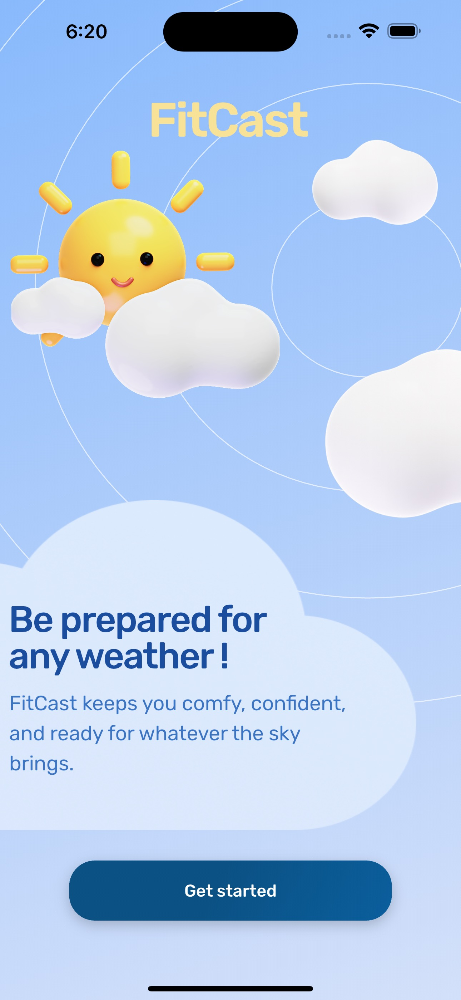
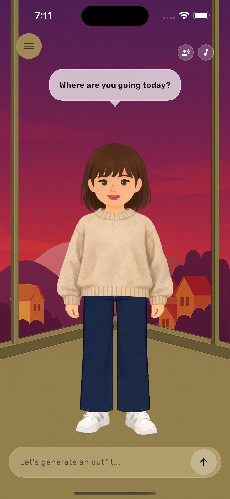
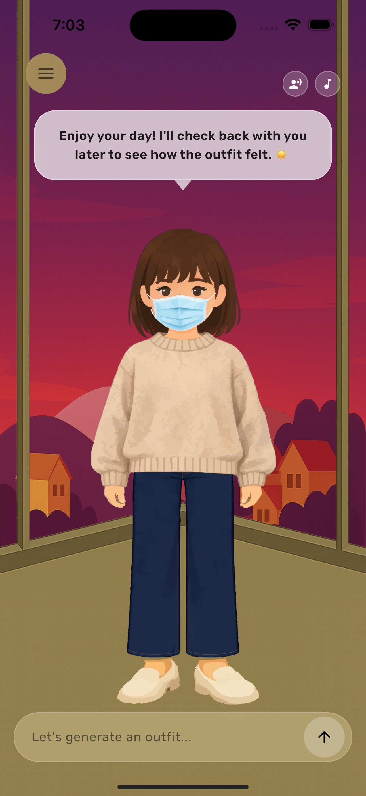
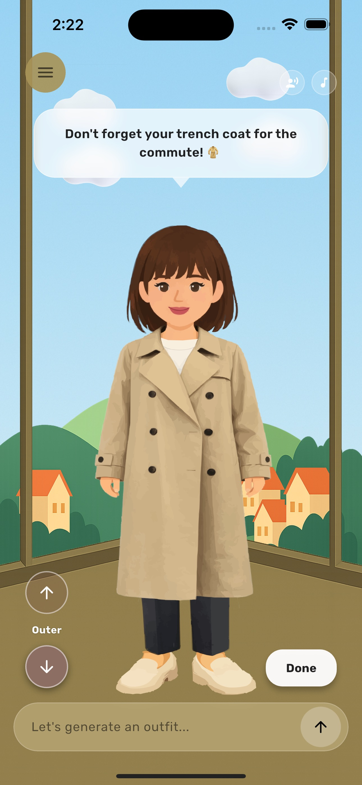

# FitCast – AI-Powered Weather-Based Outfit Recommendation System

## 📝 Overview

**FitCast** is a full-stack, AI-powered mobile application that provides personalized outfit recommendations based on real-time weather conditions, user preferences, target activities, and personal comfort levels.

Unlike traditional weather applications, FitCast transforms raw weather data into actionable clothing recommendations by combining machine learning predictions, environmental analysis, personalization, and rule-based decision making.

This project was developed as a Computer Science Senior Project at the German Jordanian University.

🎥 **Demo Video:** https://bit.ly/fitcast-demo

📄 **Project Report:** [View Full Project Report](SP_Report_AyahSaid.pdf)

---

## 📱 Application Screenshots

  
  &nbsp;&nbsp;&nbsp;&nbsp;
  

  <b>Welcome Experience</b>
  &nbsp;&nbsp;&nbsp;&nbsp;&nbsp;&nbsp;&nbsp;&nbsp;&nbsp;&nbsp;&nbsp;&nbsp;&nbsp;&nbsp;&nbsp;&nbsp;&nbsp;&nbsp;&nbsp;&nbsp;&nbsp;&nbsp;&nbsp;&nbsp;
  <b>AI Outfit Assistant</b>

  
  &nbsp;&nbsp;&nbsp;&nbsp;
  

  <b>Personalized Outfit Recommendation</b>
  &nbsp;&nbsp;&nbsp;&nbsp;&nbsp;&nbsp;&nbsp;&nbsp;&nbsp;&nbsp;&nbsp;&nbsp;
  <b>Weather-Aware Layer Suggestions</b>

 

> [!NOTE]
> FitCast provides a personalized outfit recommendation experience powered by real-time weather data, machine learning predictions, user preferences, and context-aware clothing rules. The application includes an interactive avatar assistant, adaptive weather backgrounds, outfit visualization, and dynamic layering recommendations for daily commutes and activities.

---

## 🚀 Features

### 🧠 Intelligent Outfit Recommendations & Layers

- **Contextual Suggestions:** Generates complete outfit suggestions based on current weather conditions and user activities.
- **Machine Learning Engine:** Uses a custom-trained Random Forest model built with Scikit-Learn to estimate thermal clothing requirements and recommend appropriate clothing layers based on environmental conditions.
- **Occasion Adaptation:** Supports casual, formal, university, office, gym, travel, airport, and social event contexts.
- **Layer Recommendation System:** Dynamically recommends outerwear and additional clothing layers based on perceived weather conditions.

### 🌦️ Advanced Weather Analysis

- **Live Weather Retrieval:** Integrates with the OpenWeather API to retrieve real-time environmental conditions.
- **Bioclimatic Metrics:** Evaluates temperature, humidity, wind speed, precipitation, and UV index.
- **Environmental Awareness:** Generates recommendations based on actual perceived weather rather than raw temperature values alone.

### 🔄 Personalization & Adaptive Comfort

- **Feedback Loop:** Users can rate recommendations as *Too Cold*, *Comfortable*, or *Too Warm*.
- **Adaptive Comfort Profiles:** Future recommendations are adjusted according to stored comfort preferences.
- **Persistent User Profiles:** Preferences and personalization data are securely stored using Firebase Firestore.

### 🕋 Modesty & Lifestyle Support

- **Modesty Logic Tiers:** Supports multiple outfit generation profiles including modest and hijabi configurations.
- **Health & Safety Awareness:** Recommends accessories such as masks when environmental conditions may negatively affect users with respiratory sensitivities.

### 💬 AI Assistant Interaction

- **Natural Language Processing:** Uses OpenAI APIs to interpret conversational user requests.
- **Intent Extraction:** Identifies activities, occasions, and clothing preferences directly from natural language input.
- **Interactive Avatar Assistant:** Provides a more engaging and user-friendly recommendation experience.

### 👤 Dynamic Avatar System

- **Avatar-Based Visualization:** Displays outfit recommendations on a customizable avatar.
- **Weather-Adaptive Backgrounds:** Background scenes dynamically reflect current environmental conditions.
- **Visual Outfit Layering:** Enables users to clearly visualize recommended clothing combinations.

---

## 🛠️ Technology Stack

| Category | Technology |
|-----------|-----------|
| Frontend Mobile Client | Flutter, Dart |
| Backend API Service | FastAPI, Python |
| Machine Learning Core | Scikit-Learn, Pandas, NumPy |
| Database Architecture | Cloud Firestore |
| User Authentication | Firebase Authentication |
| External Integrations | OpenWeather API, OpenAI API |
| UI/UX Design | Figma |

---

## 🏗️ System Architecture

FitCast follows a modular full-stack architecture designed to separate user interaction, backend processing, and machine learning inference.

1. **Flutter Mobile Application**  
   Handles presentation, avatar rendering, weather visualization, and user interaction.

2. **FastAPI Backend Service**  
   Hosts recommendation endpoints and coordinates feature engineering.

3. **Machine Learning Prediction Engine**  
   Performs inference over environmental and personalization features.

4. **Firebase Infrastructure**  
   Provides authentication and cloud data storage.

5. **Third-Party APIs**  
   OpenWeather supplies environmental data while OpenAI assists with natural language understanding.

---

## 📈 Key Technical Highlights

- Full-stack architecture combining Flutter, FastAPI, Firebase, and Machine Learning.
- Real-time weather-driven recommendation pipeline.
- Personalized feedback loop for adaptive comfort tuning.
- Context-aware outfit generation using activity classification.
- Avatar-based visualization system.
- OpenAI-powered conversational interaction.
- Cloud-based user authentication and preference management.

---

## 🔮 Future Improvements

- Digital wardrobe management and clothing inventory tracking.
- Clothing image recognition using computer vision techniques.
- Automatic calendar integration for proactive outfit planning.
- Expanded recommendation engine with wardrobe ownership awareness.
- Advanced personalization using continual learning approaches.

---

## 🔒 Security Notice

> [!IMPORTANT]
> To comply with security best practices, production API keys, Firebase service account configuration files, environment variables, and serialized machine learning model binaries have been excluded from this repository.

---

## 👤 Author

**Ayah Said**  
Computer Science Student  
German Jordanian University (GJU)

Senior Project Supervisor: Dr. Amani Abu Jabal
